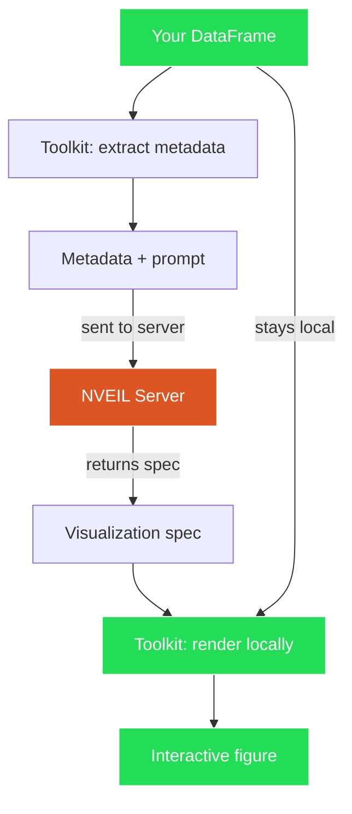

# Privacy Model

NVEIL is designed so that **raw data never leaves your machine**.

## What is sent to the server

When you call `generate_spec()`, the Toolkit sends **only metadata**:

| Sent | Example |
|------|---------|
| Column names | `"revenue"`, `"region"`, `"date"` |
| Column types | `INTEGER`, `FLOAT`, `STRING`, `DATETIME` |
| Aggregate statistics | min, max, distinct count, row count |
| Your prompt | `"Show revenue by region"` |

## What stays local

| Stays local | Why |
|-------------|-----|
| Raw data values | Never sent — the server only sees aggregate stats |
| DataFrames | Passed by reference to local pipeline and renderer |
| Rendered figures | Generated locally by the dive engine |
| `.nveil` files | Written and read on your machine; contain the spec only, never raw data |

## The flow in detail

**Green** = local. **Red** = server-side. The data path (green) never crosses to the server.

## Transport security

All communication with the NVEIL server uses HTTPS/TLS.
