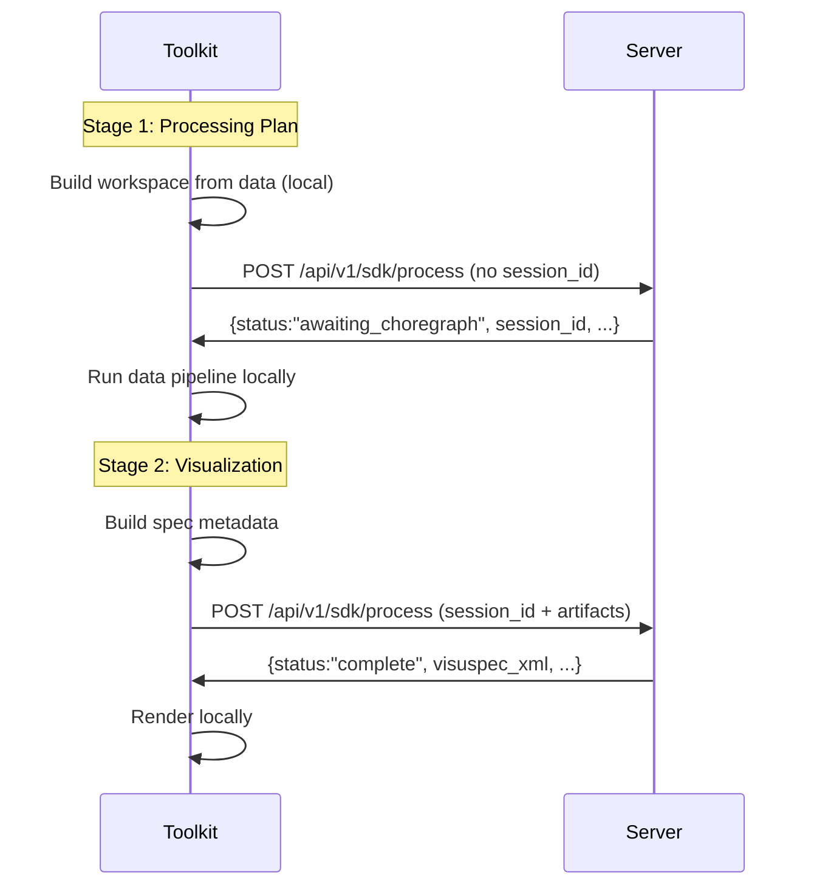

# Two-Stage Flow

Spec generation happens in two server calls, with local processing in between.

## Overview

Both stages hit the **same endpoint** — the server dispatches on whether
``session_id`` is present in the request body (no session_id ⇒ fresh
``arun`` that pauses at the choregraph interrupt; session_id present ⇒
``aresume`` from that checkpoint).

## Stage 1: Processing Plan

The Toolkit builds a workspace from your input data and sends metadata to the server along with your prompt. The server:

1. Classifies the data (what kind of visualization fits)
2. Plans the data transformations needed
3. Returns the completed processing plan

The Toolkit then runs this pipeline **locally** on your actual data.

## Stage 2: Visualization

After the local pipeline run, the Toolkit builds a spec with post-transform metadata and sends it to the server. The server:

1. Applies constraint solving to optimize the visualization
2. Selects palettes, scales, and layout
3. Returns the final spec

The Toolkit receives this spec and can render it locally.

## Why two stages?

Splitting the flow allows the server to make informed decisions based on **post-transform** data characteristics. For example, if a column is aggregated from 10,000 rows to 50 groups, the visualization strategy changes.

The server never sees the actual data at either stage — only metadata.

## Session reuse

Within a `session()`, the data pipeline runs once. Multiple `render()` calls reuse the pipeline outputs without re-running it. See [Sessions](sessions.md) for details.
